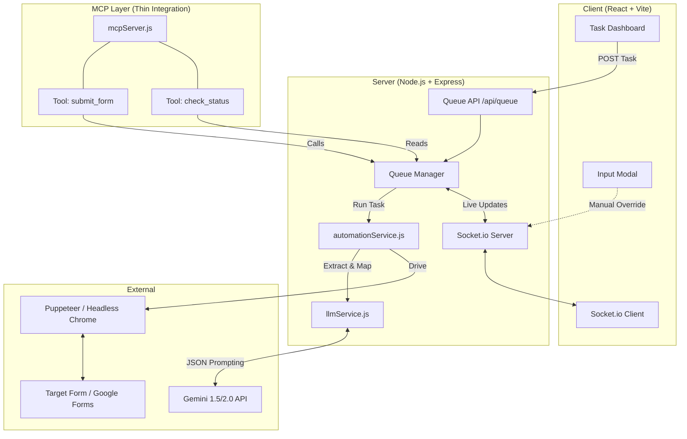

# Form Automation: Intelligent Form-Filling System

An advanced, AI-powered automation system that uses real-time LLM reasoning to parse, map, and fill complex web forms (including Google Forms) with human-like precision.


Demo Video : 


https://github.com/user-attachments/assets/12e51e95-bbf6-4ea5-8cfd-10a80421db8e


Demo Video After Mcp Integration with claude desktop :


https://github.com/user-attachments/assets/cf7764e2-d16a-4087-88c7-8e6f6ea218a9


## 🏗️ Architecture

The system follows a distributed architecture with a React frontend, a Node.js orchestration server, and an AI-driven automation engine.



## 🚀 Core Features

- **Two-Layer LLM Reasoning**: 
  - **Stage 1 (Extractor)**: Analyzes raw DOM for semantic fields and durable CSS selectors.
  - **Stage 2 (Mapper)**: Contextually maps JSON user data to the extracted fields.
- **Smart Queue Management**: Sequentially processes automation tasks to prevent browser overhead.
- **Live Status Tracking**: Real-time progress updates and log streaming via Socket.io.
- **Form Resilience**: Specialized heuristics for Google Forms, custom radio buttons, and date fields.
- **Manual Intervention**: Supports a "Waiting for Input" state for forms requiring human validation.

## 🛠️ Setup & Installation

### Prerequisites
- Node.js (v18+)
- Google Chrome installed (for Puppeteer)
- Gemini API Key

### 1. Server Setup
```bash
cd server
npm install
```
Create a `.env` file in the `server` directory:
```env
GEMINI_API_KEY=your_api_key_here
CHROME_PATH="C:\Program Files\Google\Chrome\Application\chrome.exe" # Path to your Chrome
```

### 2. Client Setup
```bash
cd client
npm install
```

## 🏃 Running the Application

1. **Start the Backend**:
   ```bash
   cd server
   node server.js
   ```
2. **Start the Frontend**:
   ```bash
   cd client
   npm run dev
   ```

## 🧪 Verification
You can use the built-in verification script to test the backend without the UI:
```bash
node server/verify_submission.js
```

## 📁 Key Components

- **`server.js`**: Express server entry point and Socket.io setup.
- **`queueManager.js`**: Handles the lifecycle of automation tasks.
- **`automationService.js`**: The Puppeteer engine and interaction logic.
- **`llmService.js`**: Encapsulates all interactions with the Gemini API.
- **`mcpServer.js`**: Thin integration layer for AI Assistant tool usage.
- **`App.jsx`**: Main dashboard layout and state management.

## 🤖 MCP Integration

This project includes a Model Context Protocol (MCP) server that allows AI assistants (like Claude Desktop) to interact with the automation queue directly.

### Tools Provided:
- `submit_form`: Submit a new automation task with a URL and JSON data.
- `check_status`: Check the status and recent logs of a specific task ID.

### Configuration for Claude Desktop:
Add the following to your `claude_desktop_config.json`:
```json
{
  "mcpServers": {
    "form-automation": {
      "command": "node",
      "args": ["E:/final kabilan altrosyn/server/mcpServer.js"],
      "env": {
        "GEMINI_API_KEY": "your_api_key_here",
        "CHROME_PATH": "C:\\Program Files\\Google\\Chrome\\Application\\chrome.exe"
      }
    }
  }
}
```
